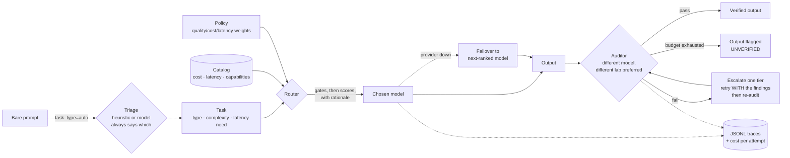

# Switchboard

[](https://github.com/JoaquinDG/switchboard/actions/workflows/ci.yml)
[](https://doi.org/10.5281/zenodo.21953772)
[](LICENSE)

**An LLM model brokerage: route every task to the most efficient model, let models audit each other, and account for what it cost.**

📄 **White paper:** [Stop Sending Everything to the Smartest Model: Policy-Based LLM Routing with Cross-Model Auditing](https://zenodo.org/records/21953773) — Diaz Gutierrez de Quijano, J. (2026). Zenodo. [doi:10.5281/zenodo.21953772](https://doi.org/10.5281/zenodo.21953772)

Zero dependencies. Runs fully offline out of the box. `git clone`, run the tests, see it work in under a minute.

```bash
PYTHONPATH=src python3 -m unittest discover -s tests   # 285 tests
PYTHONPATH=src python3 evals/routing_eval.py           # 8 routing scenarios
PYTHONPATH=src python3 evals/triage_eval.py            # 40 labeled prompts
PYTHONPATH=src python3 examples/quickstart.py          # full demo, no API keys
PYTHONPATH=src python3 examples/agentic_workflow.py --catalog examples/starter_catalog.json
```

Nothing here needs an API key, a network connection, or a build step.

## Is this for me?

**Switchboard is a library that sits between your code and the model vendors' APIs.** It is not an app, and it is not something you point at ChatGPT or Claude.

**It probably helps you if** you are building something that calls LLM APIs, you get a per-token invoice at the end of the month, and that invoice is larger than you would like. That is the situation the whole design assumes: you are paying per call, so where each call lands is a decision worth making deliberately.

**It probably does not help you if** you use ChatGPT, Claude, or Gemini through their own apps or subscriptions. There are two reasons, and the second is the real one:

1. There is nowhere to stand. Those are finished products that choose their own models internally; nothing can get between you and them.
2. **You are not paying per token.** A flat monthly subscription has no routing decision in it — sending a task to a cheaper model saves you nothing, because you are not charged for the expensive one either.

If a friend showed you this and you are wondering how to use it: you probably do not want to. The person Switchboard helps is whoever *built* the app you are using, and who sees the bill.

```
you  ->  someone's app  ->  [ SWITCHBOARD ]  ->  Anthropic / OpenAI / Google / DeepSeek / Kimi
                              ^ here                        ^ per-token billing lives here
```

Today the integration is a Python import. A local OpenAI-compatible proxy — point any existing tool at it, change no code — is the next thing on the [roadmap](ROADMAP.md).

### Compound requests: what decomposition is actually for

**Switchboard routes one task to one model.** `Broker.run_plan()` will decompose a compound request first — but the reason turned out not to be the one I expected, and the eval is what corrected it.

Routing a compound request whole means routing it at whatever the classifier makes of the *whole sentence*. Measured across 12 labeled compound requests (`evals/planner_eval.py`):

| | Cost |
|---|---|
| Routed whole, as the classifier actually labels it | $0.1280 |
| Routed whole, labelled at its **hardest** sub-task | $0.2400 |
| Routed as a **plan** | $0.1460 |

Read the first two rows together. Routing whole is cheap **because it misclassifies**: the request gets labelled by its dominant verb, lands on a small model, and the hard sub-task is never sent anywhere qualified. In **5 of 12 cases (42%)** the whole-request route landed a tier below what its hardest step needs — and the qualification gate cannot catch it, because the whole request looks like an easy extraction.

*"1. Extract the payment terms. 2. Summarize the obligations. 3. Recommend whether we should sign"* classifies whole as `extraction`, routes to the small model, and costs $0.0032. The plan costs $0.0103 and sends the "should we sign" step to a model rated for it. The cheap version was never doing that work properly.

So: **decomposition is a correctness mechanism first and a cost mechanism second.** Against a *correct* single call it is 1.6x cheaper; against the cheap mislabelled one it is 0.9x — more expensive, and worth it. The saving only shows up when the compound request was going to be labelled hard anyway, which on this set was 7 cases in 12.

The planner is biased hard **against** splitting for the same reason: over-splitting buys extra calls, extra audits and extra latency for work that needed one call. False-split rate on 10 negatives is **0%**, it gates CI, and the negatives include the hardest one — long but single-task, because length is not structure.

```python
result = broker.run_plan(
    "Extract the pricing from these pages, then summarise it, then recommend a response."
)
result.plan.describe()   # "plan: 3 steps (heuristic, confidence 0.75)"
result.verified          # True only if every step passed its own audit
```

## What it looks like

A five-step agentic pipeline dispatched through the **starter catalog** — 12 real models across 4 providers, at prices read from the vendors' own pages:

```
$ PYTHONPATH=src python3 examples/agentic_workflow.py --catalog examples/starter_catalog.json

=== Agentic workflow dispatch ===
catalog: examples/starter_catalog.json (12 models, prices verified 2026-08-15, 0 days ago)
policy:  balanced
costs:   estimated at each step's declared token volumes, at real catalog prices
         (execution is mocked — routing is real, output quality is not)

3. Strategize: recommend our pricing response
   -> dispatched to claude-opus-5 (frontier, anthropic), est. $0.0475
   -> audited by gpt-5.6-sol (cross-lab)
   -> verified: True
   -> why: policy=balanced; task_type=reasoning; complexity=0.85 (frontier gate applied) (qualification filter applied); chose claude-opus-5: quality=0.95, cost=$0.0475 (score 0.14), latency=slow

==============================================================================
DISPATCH PLAN SUMMARY
  [OK ] 1. Research: pull competitor pricing from 5 saved pages  gemini-2.5-flash-lite      $0.0013
  [OK ] 2. Synthesize: summarize findings into a comparison brief gemini-2.5-flash-lite      $0.0006
  [OK ] 3. Strategize: recommend our pricing response            claude-opus-5              $0.0475
  [OK ] 4. Write: draft the new pricing page copy                gemini-3.7-flash           $0.0049
  [OK ] 5. Integrate: generate the webhook code to update the website deepseek-v4-pro            $0.0018
------------------------------------------------------------------------------
  Routed pipeline, estimated:       $0.0561
  Best-model-every-step, estimated: $0.2564
  Estimated saving from routing:    $0.2003  (78%)
```

The same pipeline on the synthetic demo catalog (`--catalog` omitted) routes to `atlas-small / atlas-small / atlas-frontier / atlas-mid / atlas-mid` for an estimated 69% saving.

**How to read those numbers.** The routing is real — real catalog, real prices, the real router, and the rationale is the one production would emit. The *execution* is mocked, so nothing here says anything about output quality. The dollar figures are estimates at the token volumes declared on each Task, not a bill; wire in a real provider and `BrokerResult.total_cost_usd` reports observed tokens with audits included. To record a terminal cast of this yourself: `asciinema rec -c "PYTHONPATH=src python3 examples/agentic_workflow.py --catalog examples/starter_catalog.json"`.

## What happened when it ran for real

On 2026-08-15 the suite in `examples/live_run.py` ran against **all five providers — Anthropic, OpenAI, Google, DeepSeek and Kimi** — four runs, twenty real cross-lab audits, **$0.24 total**. Every catalog id was verified by a real call first. Every number below is measured, not modelled.

### Finding 1: the token ceiling was manufacturing fake quality failures

Same tasks, same models, same policy. Only `--max-tokens` changed:

| | 400 | 1200 |
|---|---|---|
| Verified | 3/5 | **4/5** |
| Escalations | 2 | **1** |

At 400, `claude-opus-5` spent **340 of its 400 output tokens thinking** and returned almost no visible text. `stop_reason: max_tokens`. The auditor called it empty — correctly — the broker read that as a quality failure and escalated to a stronger model, which would have truncated at exactly the same ceiling. Reasoning models truncate *sooner*, because thinking spends the same budget.

The adapter had been discarding `stop_reason` entirely, so a mechanical failure was indistinguishable from a bad answer. `Completion.truncated` now carries it, the audit names it before any quality finding, and `BrokerResult.truncated` surfaces it. **Escalating on truncation is pure waste** — the fix is a bigger ceiling, not a bigger model.

### Finding 2: routing honoured the policy; escalation ignored it

Escalation picked the next tier's model by raw capability, so a `cost_first` run could fail an audit and jump straight to the most expensive model in the catalog. With one frontier model per provider this never showed. With five frontier models spanning $12–$50 per million output tokens, it decides the bill.

Moving up a tier is already the quality step. *Which* model in that tier is still a cost/quality tradeoff, and the policy is what decides tradeoffs. Escalation now scores candidates with the same function routing uses — one implementation, so the two cannot drift.

Measured on the same failing task: escalation moved from `claude-opus-5` ($25/M out) to `gemini-3.1-pro-preview` ($12/M out) under `balanced`, and reached **the same audit verdict, 0.68**. Suite generation cost fell from $0.024 to $0.003 — partly the cheaper rate, partly a more concise answer, so read it as a direction rather than a multiplier.

### Finding 3: a policy sweep, and one preset that does not do what it says

Same five tasks under each preset, five providers, 1200-token ceiling:

| | cost_first | balanced | quality_first |
|---|---|---|---|
| Verified | 5/5 | 3/5 | 5/5 |
| Generation, routed | $0.00325 | $0.00405 | $0.00460 |
| Saved on generation | 92% | 93% | 75% |
| Audit overhead | 94% | 92% | 91% |
| **Total** | **$0.05116** | **$0.05088** | **$0.04937** |

Two things fall out of that table.

**Total spend barely moves.** Under a frontier auditor on small tasks, verification is ~92% of the bill and roughly constant, so the routing policy — the thing this entire library exists to make explicit — changes the total by about 4%. Routing dominates *generation* cost; verification dominates *total* cost. Both are true and they point in different directions.

**`quality_first` routed to mid-tier models, not frontier.** Not a router bug — a scale bug in the weights. Cost and latency are normalized to span [0, 1]; capability is used raw and clusters tightly. On this catalog capability spans 0.78-0.90 for extraction, so an 0.85 quality weight buys 0.102 of influence while an 0.10 latency weight buys 0.080. On `reasoning@0.6`, `claude-opus-5`'s 0.093 quality advantage loses to `gemini-3.7-flash`'s 0.080 latency advantage.

The obvious fix — normalize capability like cost — was prototyped and **rejected**: it works on a 16-model catalog and breaks on the 3-model demo one, where a 0.10 capability spread becomes a full 0-to-1 swing and `balanced` starts sending easy extraction to a frontier model. That is the same artifact already fixed for cost, reintroduced on another axis. The finding and the failed fix are both recorded in [ROADMAP.md](ROADMAP.md) item 1b rather than patched over.

### Finding 4: verification, not inference, dominates the bill

| | default auditor | `cheapest_qualified` |
|---|---|---|
| Generation, routed | $0.01633 | $0.01721 |
| Generation, strongest model | $0.03623 | $0.02493 |
| **Routing saved on generation** | **55%** | **31%** |
| Audit overhead | $0.04609 (**74% of spend**) | $0.00472 (22%) |
| Total | $0.06242 | $0.02193 |

On the summarization task the audit cost **188x the generation it graded**. The audit prompt carries the task, the output *and* the rubric, so it has a floor a small task cannot amortise. `auditor_selection="cheapest_qualified"` cut audit cost 90% and total spend 65%, reaching the same pass/fail on all five tasks — one needed an extra escalation to get there, because the cheap auditor was *stricter* on first pass. n=5; suggestive, not settled.

### Finding 5: a listed model is not a working model

`live_check.py` diffs the catalog against each vendor's `/models` endpoint for free. That is necessary and **not sufficient**: `gemini-2.5-flash-lite` was still listed and returned `404 no longer available` at the chat endpoint. Listing proves a name is known, not that it is served.

`--probe` closes the gap by making one 16-token call per model. It distinguishes a retired model from a `429` (your quota, not a bad catalog entry), and it exposed a false negative in its own first version: a 1-token probe made OpenAI's reasoning models return `400 max_tokens reached`, which says nothing about whether they exist. Same lesson as Finding 1 — thinking tokens come out of the visible budget — arriving from the opposite direction.

### Finding 6: cross-lab auditing caught real defects

`claude-opus-5` flagged that a `median()` written by `deepseek-v4-flash` returned an `int` where its annotation promised `float`. Better: on the reasoning task, `gpt-5.6-sol` caught `claude-opus-5` **inventing per-token prices that were never in the prompt**. A same-lab audit is exactly where you would expect that to slide through.

### Finding 7: unverified means unverified

The one remaining failure scored 0.68 against a 0.70 threshold — a real quality judgment, not a mechanical one, and reproduced identically across runs. It was returned flagged rather than shipped.

Final run, five providers, 16/16 models probe-verified: **4/5 verified, 1 escalation, $0.003 generation vs $0.054 on the strongest model (94% saved), $0.059 total — of which 95% was audit.** With generation this cheap, verification is essentially the entire bill, which is the argument for `cheapest_qualified` in Finding 3.

Reproduce with `examples/live_check.py` (free) then `examples/live_run.py --live`.

## The problem

Teams building on LLMs default to one of two bad equilibria: **send everything to the frontier model** (10–30x overspend on tasks a small model handles fine) or **send everything to the cheap model** (quality failures you only discover from angry users). The tradeoff between quality, cost, and latency is a real product decision — but in most codebases it's made implicitly, model IDs hardcoded at every call site, invisible and unversioned.

And even when routing is right, a single model grading its own output is structurally unreliable: models are systematically charitable to themselves.

## The approach

Switchboard makes five things explicit that are usually implicit:

1. **The catalog** (`registry.py`) — every model described by cost, latency class, and per-task capability scores that *you* maintain from your own evals. Routing quality is only as good as the catalog, so the catalog is a first-class, versionable artifact — not vibes scattered across call sites. It's validated on load, and warns when its prices go stale.
2. **The policy** (`policies.py`) — quality/cost/latency weights in one named, auditable object. `cost_first` vs `quality_first` is a product decision; it should be visible in a diff, not archaeology.
3. **The triage** (`triage.py`) — callers can send a bare prompt with `task_type="auto"` and have the type and complexity inferred, rather than hand-labelling every request at the call site.
4. **The verification loop** (`auditor.py`, `broker.py`) — a *different* model, preferably from a *different lab*, grades each output. Failed audits escalate one tier up, carrying the auditor's findings. If verification is exhausted, the output is returned **flagged as unverified** rather than silently passed through.
5. **The bill** (`broker.py`) — every attempt records what it actually cost at observed token counts, audits included, against a baseline of "what if we'd just used the best model".

## Architecture



Routing runs gates before scores:

1. **Frontier gate** — complexity above the policy threshold is only eligible for frontier models, regardless of cost pressure.
2. **Qualification gate** — a model's capability for the task type must clear the task's complexity by a margin. A model should never win a task it isn't qualified for just because it's cheap.
3. **Weighted scoring** — survivors are scored on quality, log-normalized cost (over the full catalog range), and latency, per policy weights. Every decision returns the full ranked list and a human-readable rationale.

**Gates degrade upward, never open.** If a gate would leave zero candidates, the fallback is the most capable tier available plus a warning on the decision — not a silent return to the full catalog. Falling back to the full catalog hands the decision to cost weight, which is exactly what the gate existed to prevent. `RoutingDecision.underqualified` and `.warnings` carry that out to the caller, and `Policy.on_no_qualified_model` can make it raise instead.

## Starter catalog

`examples/starter_catalog.json` is a working catalog of **16 models across 5 providers** (Anthropic, OpenAI, Google, DeepSeek, Kimi/Moonshot), every id verified by a real call. It is what makes the demos show real model names instead of `atlas-small`, and four providers is deliberate — cross-lab auditing needs somewhere to cross to.

The line between what was measured and what was guessed is the whole point of the file, so it is drawn explicitly:

- **Prices are real.** Every `input_cost` / `output_cost` was read from the vendor's own pricing page on **2026-08-15**, and each model carries the URL it came from in a `_source` field. Known caveats — promotional rates with an expiry, tiered pricing above 200k tokens, a vendor introducing peak/off-peak pricing the day after verification — are recorded in `_pricing_caveats` rather than quietly averaged away.
- **Capability scores are estimates.** They are one engineer's priors about relative model strength. **No benchmark was run to produce them and none is implied.** They exist so the catalog loads and routes out of the box. Replace them with numbers from your own evals on your own traffic before making real routing decisions — the router is only as good as this field.
- **Latency classes are estimates too**, assigned by tier rather than measured.
- **Prices go stale.** `Registry.from_json` reads `_last_verified` and raises a `CatalogStaleWarning` once the catalog is more than 60 days old. A router confidently using last quarter's price list is precisely the failure this project exists to prevent.

Run any example against it with `--catalog examples/starter_catalog.json`. Because the catalog names real vendors, `mock_pool(registry)` supplies one offline stand-in per provider, so the whole system — cross-lab audits and provider failover included — is exercisable without a single API key.

## Running it for real

Everything above is offline and mocked, and that honesty has a cost: `verified: True` from `MockProvider` means a canned string was graded by a canned grader. It demonstrates the machinery, not the idea. Two scripts close that gap against Anthropic, OpenAI, DeepSeek, and Google.

**Step 1 — verify the catalog. Free.**

```bash
PYTHONPATH=src python3 examples/live_check.py --catalog examples/starter_catalog.json
```

Every `model_id` in a catalog is a claim that a string will be accepted by a vendor, and **nothing in the offline suite can check it** — `MockProvider` answers to any id you give it. A typo, a renamed model, or an id copied from a pricing page that uses display names rather than API names survives all 285 tests and then fails as a hard 404 on first real traffic. This lists what each key can actually reach, diffs it against the catalog, and suggests close matches for anything missing. It only issues GETs to the models endpoints, so it generates no tokens.

**Step 2 — run real tasks. This spends money.**

```bash
PYTHONPATH=src python3 examples/live_run.py --catalog examples/starter_catalog.json --live --budget-usd 0.50
```

Without `--live` it prints the plan and the worst-case bill and calls nobody. With it, a real model produces output, a **different real model from a different lab** grades it, escalation fires on genuine disagreement, and the cost accounting reports an actual bill against observed tokens.

Guards, because this is the one part of the repo that can cost you: dry-run is the default; `--budget-usd` is a hard cap checked before each task against its *worst* case (priciest model, every escalation, every audit — not its expected case); `--max-tokens` bounds the term that dominates cost. Real spend on the default suite is typically 10–30x below the ceiling, because routing sends most of it to cheap models.

**Keys.** Read from the environment only — never from a file, never written to one, never logged, never traced. The only thing any of this reports about a key is whether it is set.

| Provider | Variable | Get one |
|---|---|---|
| `anthropic` | `ANTHROPIC_API_KEY` | [console.anthropic.com](https://console.anthropic.com/settings/keys) |
| `openai` | `OPENAI_API_KEY` | [platform.openai.com](https://platform.openai.com/api-keys) |
| `deepseek` | `DEEPSEEK_API_KEY` | [platform.deepseek.com](https://platform.deepseek.com/api_keys) |
| `google` | `GEMINI_API_KEY` | [aistudio.google.com](https://aistudio.google.com/apikey) |
| `moonshot` (Kimi) | `MOONSHOT_API_KEY` | [platform.kimi.ai](https://platform.kimi.ai/console/api-keys) |

Any subset works. Providers without a key are skipped and named, and `usable_registry` narrows the catalog to what's actually wired up — so a missing key reads as a smaller catalog rather than a mysterious outage. Cross-lab auditing needs two.

Integration tests are opt-in twice over — `SWITCHBOARD_LIVE_TESTS=1` **and** the relevant key — so keys exported for ordinary work never start billing test runs by accident. CI stays fully offline.

```bash
SWITCHBOARD_LIVE_TESTS=1 PYTHONPATH=src python3 -m unittest tests.test_live
```

## Task-type inference

Callers should not have to hand-label every request. Send `task_type="auto"` and triage fills in both fields:

```python
result = broker.run(Task(prompt="Refactor this module to remove the duplicated retry logic.",
                         task_type="auto"))

result.triage.task_type   # "coding"
result.triage.complexity  # 0.55
result.triage.source      # "heuristic"
result.routing_rationale  # "triage: classified as coding, complexity 0.55 (heuristic); policy=..."
```

Two layers, in deliberate order. The **heuristic** is the default: weighted keyword and structure signals, offline, deterministic, free, and auditable — every classification reports the signals that produced it. The **model-based** layer is opt-in (`Broker(..., triage_use_model=True)`), asks the cheapest model in the catalog, and falls back to the heuristic on *any* failure. Triage is a routing input, so it must never be able to take the run down with it.

**The rationale always names the layer that decided.** `(heuristic)` and `(model:claude-haiku-4-5-20251001)` are different claims, and a reviewer reading a trace is entitled to know which one they're looking at. When the model layer fails and the heuristic answers instead, `source` says `heuristic` — never the model that didn't work.

### Confidence-gated: measured, then shipped

The heuristic's confidence turns out to separate its own errors perfectly. Across 40 labeled prompts run against live APIs (`examples/triage_ab.py`):

| | n | mean confidence | max |
|---|---|---|---|
| Heuristic **correct** | 36 | 0.93 | 1.00 |
| Heuristic **wrong** | 4 | **0.00** | **0.00** |

Zero overlap. So gating on confidence beats either layer used alone:

| Strategy | Accuracy | Held-out | Model calls | Cost |
|---|---|---|---|---|
| Heuristic only | 90% | 60% | 0 | free |
| Model always | 95% | 90% | 40 | $0.00089 |
| **Hybrid at 0.25** | **98%** | **90%** | **5** | $0.00011 |

Asking a model on every prompt is *worse* than the hybrid — it overrides cases the heuristic already had right (it mislabelled "Debug this stack trace" and "What is wrong with this function?" as reasoning). Gating keeps the heuristic's wins, buys the model's wins on the 12% where the heuristic had no signal, and costs ~$0.00002 per classification.

The real cost is latency, not money: ~1.6s per model classification, which is why calling it 5 times instead of 40 matters. `Policy.triage_confidence_threshold` defaults to 0.25; set it to 0.0 to never ask a model, above 1.0 to always.

### How good is the heuristic alone, honestly

`evals/triage_eval.py` scores 40 labeled prompts and reports two numbers separately, because only one of them means anything:

```
combined accuracy:  36/40 = 90% (threshold 80%)
  tuned:            30/30 = 100% <- measures internal consistency, not skill
  held-out:         6/10 = 60%  <- the number to believe
```

The tuned set was written alongside the keyword table by the same person, so 100% mostly measures that the author agreed with themselves. The held-out set was written after the classifier was frozen and is deliberately never tuned against. **60% is the honest figure.**

Every held-out failure collapsed to `reasoning`, the conservative default — the heuristic needs a canonical verb ("summarize", "refactor", "extract"), and ordinary rephrasings like *"Cut this 800-word intro down to 200 words"* or *"Turn this changelog into a release note"* match nothing and fall through. That failure mode over-routes to expensive models rather than under-routing to cheap ones, which is the right direction to be wrong in, and it is the clearest argument for the model-based layer. One held-out pass was luck: *"Which of these two onboarding flows would you ship, and why?"* matched nothing and defaulted to `reasoning`, which happened to be correct — the printed confidence of `0.00` is what gives that away.

## Design decisions & tradeoffs

**Heuristic scoring, not learned routing.** A learned router would eventually beat hand-set weights, but it's a black box from day one and needs volume you don't have at the start. Explicit weights + decision traces get you explainability now and the training data for a learned router later. The JSONL traces are that dataset — and they carry cost, audit outcomes, and which triage layer fired, which is what makes them trainable rather than merely readable.

**The auditor never grades its own producer — and prefers a different lab.** Independence is enforced by construction in `pick_auditor`, in two degrees. A different *model* is required, because self-grading inflates pass rates. A different *provider* is preferred, because two models from one lab share training data and alignment, so their blind spots correlate and a same-lab pass is weaker evidence than the number suggests. Single-vendor catalogs still get audited — the verdict just carries `cross_lab=False`, and so does the trace, so you can ask what share of your verified output was signed off by a sibling. The cross-lab filter runs *before* `auditor_selection`: independence outranks both capability and price.

**Fail closed.** An unparseable audit verdict counts as a failure, and so does an auditor that can't be reached — verification must not evaporate exactly when the platform is least healthy. Parsing is tolerant of *format* (fences, surrounding prose, `"true"` for `true`) and strict about *meaning*: a score outside `[0, 1]` is a failure, not something to clamp, because clamping launders a schema violation into a pass.

**Escalate with the findings, not just a bigger model.** When an audit fails, the auditor's issues are folded into the retry prompt, so the stronger model gets a repair briefing instead of a blind re-roll. The findings survive a mid-escalation failover too. The *audit* still grades against the original task prompt, never the repair briefing, or the second audit would be scoring the repair process instead of the work.

**Escalate once by default.** Unbounded retry loops burn money chasing tasks that need a human. `max_escalations` is a policy knob; the default is deliberately conservative.

**Availability is not quality.** A provider outage reroutes to the next-ranked model on its own `max_provider_failovers` budget, without consuming escalation budget. Conflating the two means one 503 silently disables quality escalation for that task. A missing API key is the exception: that's a deployment bug, and rerouting around it would quietly move traffic to a pricier provider and hide the misconfiguration until the invoice arrives.

**Audits cost real money, and now it is measured.** Unaudited outputs are never marked `verified`. In the live run above, verification was **74% of total spend** with the default frontier auditor, peaking at **188x the generation cost** on one small task — the audit prompt carries the original prompt plus the output plus the rubric, so it has a floor a small task cannot amortise. That is fine on a 4,000-token document and absurd on a 40-token one. `Policy.auditor_selection="cheapest_qualified"` buys the cheapest model clearing `min_auditor_capability` instead. The default stays `most_capable`, because a weak auditor is a fake one.

## What the eval suite caught (learnings)

Real bugs, found by the evals rather than the unit tests, documented rather than quietly fixed:

1. **Cost pressure routed mid-complexity coding to an underqualified small model.** The fix became a feature: the qualification gate, now also a regression test.
2. **Cost normalization over only surviving candidates created artifacts.** With two candidates, min-max scoring forces one to 0.0 — a normalization artifact, not a real cost signal — which flipped a quality-first decision toward a mid model. Fix: normalize over the full catalog range.
3. **Both gates failed *open*.** When no model cleared the qualification bar, the gate silently skipped and the full candidate list came back, so cost weight decided. An unscored `task_type` — a typo, or a task type nobody had rated yet — collapsed every model onto the same 0.5 prior, cleared nothing, and sent 0.75-complexity work to the cheapest model *under a quality-first policy*. Gates now degrade upward and say so.
4. **Same-lab audits were being counted as full independence.** `pick_auditor` excluded the producer but happily picked its sibling from the same provider. Nothing was wrong with the pass-rate arithmetic; the pass rate just meant less than it looked like.
5. **The margin made the qualification gate unsatisfiable at the top of the scale.** Complexity 0.9 plus a 0.1 margin demands a capability of 1.0, which no honest catalog claims, so every hard task got flagged underqualified and the warning became noise. The buffer is dropped when there's no headroom for it; the raw requirement still applies.
6. **A real catalog could not be run at all.** Every example built `ProviderPool([MockProvider()])`, which fails on the first model whose provider isn't literally named `mock` — so the offline demos only ever worked against the synthetic catalog, and the multi-provider features had never been exercised end to end. `mock_pool(registry)` fixed it, and cross-lab auditing started firing the moment it did.
7. **Triage scored 100% on the set it was built against and 60% on a held-out set.** The gap *is* the finding, and it is why both numbers are printed. See the section above.

8. **Two catalog model ids did not exist.** `examples/live_check.py` diffed the catalog against the vendors' live `/models` endpoints and found `DeepSeek-V4-Pro-0813` and `DeepSeek-V4-Flash-0731` were unreachable — the docs page lists dated snapshot names while the API serves `deepseek-v4-pro` / `deepseek-v4-flash`. Both were guaranteed 404s, and the entire offline suite passed over them, because `MockProvider` answers to any string. Notably the ids I *expected* to be wrong (OpenAI's) were all correct.
9. **`api_key=""` silently used the ambient environment key.** `api_key or os.environ.get(...)` treats an explicit empty string as "unset", so a caller passing a config value that failed to load would have billed whatever account happened to be exported in the shell instead of failing loudly. A test asserted the right behaviour and had passed for the wrong reason — there was simply no env key to fall through to. It surfaced the moment real keys were present, and made an unintended API call on the way out.
10. **The live runner's own summary was apples-to-oranges.** It compared total spend *including* audits against a baseline computed *without* them, charging routing for verification the baseline never paid for. Now reported as three separate lines, because routing and verification are separate economic decisions.

13. **Escalation ignored the policy.** It picked the next tier's model by raw capability, so a cost-first run could fail an audit and escalate to the priciest model in the catalog — routing honoured the weights and escalation overrode them. Invisible until the catalog held five frontier models at $12–$50 per million output tokens. Both paths now share one scoring function.

12. **A vendor listed a model it no longer serves.** `gemini-2.5-flash-lite` appeared in `/models` and returned `404 no longer available` at the chat endpoint, so the free listing check passed it. `live_check.py --probe` now makes a real 16-token call per model, and distinguishes retired from rate-limited. Its own first version used a 1-token budget and reported OpenAI's reasoning models as broken — a false negative with the same root cause as the truncation bug.

11. **A token ceiling was being misdiagnosed as poor quality.** The adapters discarded `stop_reason`, so an answer cut off at `max_tokens` looked identical to a complete bad one. A reasoning model that spent 340 of 400 output tokens thinking returned almost nothing, failed its audit as "empty", and triggered a paid escalation to a model that would truncate at the same ceiling. Raising the ceiling took the suite from 3/5 verified with 2 escalations to 4/5 with 1. Truncation is now carried on `Completion.truncated`, named by the auditor before any quality finding, and surfaced on `BrokerResult`.

14. **Decomposition is not primarily a cost optimisation.** The planner was built on a measured 2.9x — a compound request routed whole costs 2.9x the same work routed as four steps. The planner eval then showed that figure assumes the whole request is *correctly labelled hard*. In practice the classifier labels a compound request by its dominant verb, so routing it whole is often **cheaper** — because it silently under-routes. On 12 labeled compound requests the whole-request route landed below its hardest sub-task's required tier **42% of the time**, which the qualification gate cannot catch since the request looks easy. Decomposition's first-order benefit is surfacing that hard step, not saving money; against a *correct* single call it is 1.6x cheaper, against the mislabelled one 0.9x.

15. **The planner silently dropped part of the request.** Splitting on `then` produced a two-word fragment, and a minimum-length filter discarded it — so "extract the pricing, then summarize it, then recommend a response" planned three steps' worth of intent into two and never summarised anything. Short fragments now merge into a neighbour.

16. **Caller-supplied token estimates were discarded on split.** A request declared at 12k input tokens planned as steps of ~120, so the router priced a large job as a trivial one. Found because the eval's cost comparison produced an impossible number and the estimator, not the economics, turned out to be what it was measuring.

The meta-lesson: scenario evals that encode *product expectations* catch a different class of bug than unit tests, a held-out set catches a different class again, and **running against real APIs catches a fourth class that no amount of mocking can** — dead model ids, credential fallthrough, and the true shape of the cost curve. All the offline layers run in CI, on Python 3.10–3.13; the live layer is opt-in and manual.

## Using real models

1. Start from `examples/starter_catalog.json`, re-check the prices against the `_source` URLs, and replace the capability scores with results from your own evals.
2. Wire in providers — `AnthropicProvider` and `OpenAICompatibleProvider` are included (stdlib-only, keys from the environment, never from code):

```python
from switchboard import AnthropicProvider, Broker, OpenAICompatibleProvider
from switchboard import BALANCED, ProviderPool, Registry, Task

registry = Registry.from_json("examples/starter_catalog.json")
providers = ProviderPool([
    AnthropicProvider(),                                             # ANTHROPIC_API_KEY
    OpenAICompatibleProvider(),                                      # OPENAI_API_KEY
    OpenAICompatibleProvider(base_url="https://api.deepseek.com", name="deepseek"),
])
broker = Broker(registry, providers, BALANCED, trace_path="traces/prod.jsonl")

result = broker.run(Task(prompt="Summarize this contract for a non-lawyer.", task_type="auto"))
print(result.final_model, result.verified)
print(f"${result.total_cost_usd:.4f} vs ${result.baseline_cost_usd:.4f} baseline")
if result.underqualified:
    print("routed without a qualified model:", result.warnings)
```

Both adapters retry `429`/`5xx`/timeouts with exponential backoff and jitter, honour `retry-after`, and translate failures into typed errors (`ProviderRateLimited`, `ProviderUnavailable`, `ProviderTimeout`, `ProviderConfigError`) so the broker can tell "reroute around this" from "stop, you have a bug". Malformed requests (`400`, `404`) are not retried. `OpenAICompatibleProvider` sends `max_completion_tokens` against `api.openai.com` and `max_tokens` elsewhere; override with `max_tokens_param=`.

## Testing your own policies

`ScriptedProvider` replays exact text per model, so audit parsing, escalation, and failover are testable without the network or an API key:

```python
from switchboard import ProviderPool, ProviderUnavailable, ScriptedProvider

providers = ProviderPool([ScriptedProvider({
    "claude-haiku-4-5-20251001": [ProviderUnavailable("503")],   # inject an outage
    "claude-sonnet-5":           ["a stronger draft"],
    "gemini-3.1-pro-preview":    ['{"pass": true, "score": 0.9, "issues": []}'],
}, name="anthropic")])
```

Queue entries are strings (returned) or exceptions (raised); the last entry repeats once exhausted.

## Roadmap

Full backlog with rationale and acceptance criteria: **[ROADMAP.md](ROADMAP.md)**. The highest-value items are the ones that fix something the repo currently gets wrong rather than something it merely lacks:

- **Trace-driven catalog feedback** — replace the starter catalog's *estimated* capability scores with pass-rates measured from `traces/*.jsonl`. The weakest claim in the repo, and the data is already being recorded.
- **Context-window awareness** — `ModelSpec.context_window` is stored, validated, and never read by the router. A task larger than a model's window can be routed to it today.
- **Tokenizer-aware cost** — the catalog notes that Claude 4.7+ produce ~30% more tokens for the same text, so comparing vendors on per-token price alone is biased.
- **Batch-API pricing** — a ~50% discount the router cannot currently see.
- **Confidence-gated triage** — the heuristic's failures cluster where it reports `0.00` confidence; spend a model call only there.

Then: budget-aware policies, multi-auditor consensus, shadow routing for policy A/B, prompt-cache-aware costing, async providers, measured latency classes, hard capability flags, and a counterfactual "why not X?" explainer.

## Repo map

```
src/switchboard/
  registry.py        catalog (cost, latency, capabilities); validated + freshness-warned on load
  policies.py        Task + Policy: the explicit tradeoff
  triage.py          bare prompt -> task_type + complexity, always labeled by layer
  prompts.py         audit + retry prompt text, single owner, no test-only markers
  router.py          gates -> scoring -> explained decision (+ warnings)
  auditor.py         cross-lab verification, fail-closed, tolerant parsing
  broker.py          route -> run -> audit -> escalate w/ findings -> failover, costs, tracing
  providers/         Provider protocol, offline mock + scripted double, HTTP adapters with retries
ROADMAP.md           the working backlog: what to build next and how not to fake it
tests/               285 tests (router, gates, triage, auditor, costs, resilience, catalog, live wiring)
evals/               8 routing scenarios, 40 triage prompts, 22 planner cases
examples/            quickstart, agentic workflow, live_check/live_run/triage_ab, catalogs
CITATION.cff         machine-readable citation; drives GitHub's "Cite this repository"
```

## Changelog

**0.3.0**
- Starter catalog: 12 real models, 4 providers, prices verified against vendor pages with per-model `_source`; `CatalogStaleWarning` after 60 days; validated in CI
- Task-type inference: `task_type="auto"`, deterministic heuristic + optional model layer, rationale always names the layer, 40-prompt eval reporting tuned and held-out accuracy separately
- `mock_pool(registry)` — run any real catalog end to end offline
- `examples/agentic_workflow.py --catalog/--policy`, replacing a stray script at the repo root

**0.2.0**
- Auditor prefers a different **lab**; same-lab fallbacks flagged `cross_lab=False` on verdict, attempt, and trace
- Escalation injects the auditor's findings into the retry prompt; findings survive failover; audits still grade the original prompt
- Gates degrade **upward** instead of failing open; `underqualified` / `warnings` / `gates` expose why
- Per-attempt and per-run cost accounting against a baseline model, all of it traced
- Provider failover on outage, budgeted separately from escalation; config errors abort rather than reroute
- HTTP retries with jittered backoff and typed errors; `max_completion_tokens` vs `max_tokens` by base URL
- Catalog validated on load with errors naming the offending entry; `ScriptedProvider` / `FlakyProvider`; `py.typed`; CI on 3.10–3.13

## Citing this work

The paper describes the design; this repository is the implementation and the
measurements. Both are citable.

> Diaz Gutierrez de Quijano, J. (2026). *Stop Sending Everything to the Smartest
> Model: Policy-Based LLM Routing with Cross-Model Auditing.* Zenodo.
> https://doi.org/10.5281/zenodo.21953772

```bibtex
@misc{diazgutierrezdequijano2026switchboard,
  author       = {Diaz Gutierrez de Quijano, Joaquin},
  title        = {Stop Sending Everything to the Smartest Model:
                  Policy-Based LLM Routing with Cross-Model Auditing},
  year         = {2026},
  publisher    = {Zenodo},
  doi          = {10.5281/zenodo.21953772},
  url          = {https://doi.org/10.5281/zenodo.21953772},
  note         = {Preprint. Code: https://github.com/JoaquinDG/switchboard}
}
```

The badge and BibTeX use the **concept DOI** (`…772`), which always resolves to
the newest version. To cite this exact release instead, use the version DOI
[`10.5281/zenodo.21953773`](https://doi.org/10.5281/zenodo.21953773).

`CITATION.cff` carries the same metadata, so GitHub's "Cite this repository"
button stays in step with the record.

MIT licensed. The paper is CC BY 4.0.
