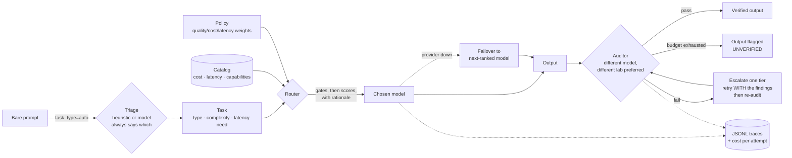

# Switchboard

[](https://github.com/JoaquinDG/switchboard/actions/workflows/ci.yml)

**An LLM model brokerage: route every task to the most efficient model, let models audit each other, and account for what it cost.**

Zero dependencies. Runs fully offline out of the box. `git clone`, run the tests, see it work in under a minute.

```bash
PYTHONPATH=src python3 -m unittest discover -s tests   # 186 tests
PYTHONPATH=src python3 evals/routing_eval.py           # 8 routing scenarios
PYTHONPATH=src python3 evals/triage_eval.py            # 40 labeled prompts
PYTHONPATH=src python3 examples/quickstart.py          # full demo, no API keys
PYTHONPATH=src python3 examples/agentic_workflow.py --catalog examples/starter_catalog.json
```

Nothing here needs an API key, a network connection, or a build step.

## What it looks like

A five-step agentic pipeline dispatched through the **starter catalog** — 12 real models across 4 providers, at prices read from the vendors' own pages:

```
$ PYTHONPATH=src python3 examples/agentic_workflow.py --catalog examples/starter_catalog.json

=== Agentic workflow dispatch ===
catalog: examples/starter_catalog.json (12 models, prices verified 2026-08-15, 0 days ago)
policy:  balanced
costs:   estimated at each step's declared token volumes, at real catalog prices
         (execution is mocked — routing is real, output quality is not)

3. Strategize: recommend our pricing response
   -> dispatched to claude-opus-5 (frontier, anthropic), est. $0.0475
   -> audited by gpt-5.6-sol (cross-lab)
   -> verified: True
   -> why: policy=balanced; task_type=reasoning; complexity=0.85 (frontier gate applied) (qualification filter applied); chose claude-opus-5: quality=0.95, cost=$0.0475 (score 0.14), latency=slow

==============================================================================
DISPATCH PLAN SUMMARY
  [OK ] 1. Research: pull competitor pricing from 5 saved pages  gemini-2.5-flash-lite      $0.0013
  [OK ] 2. Synthesize: summarize findings into a comparison brief gemini-2.5-flash-lite      $0.0006
  [OK ] 3. Strategize: recommend our pricing response            claude-opus-5              $0.0475
  [OK ] 4. Write: draft the new pricing page copy                gemini-3.7-flash           $0.0049
  [OK ] 5. Integrate: generate the webhook code to update the website DeepSeek-V4-Pro-0813       $0.0018
------------------------------------------------------------------------------
  Routed pipeline, estimated:       $0.0561
  Best-model-every-step, estimated: $0.2564
  Estimated saving from routing:    $0.2003  (78%)
```

The same pipeline on the synthetic demo catalog (`--catalog` omitted) routes to `atlas-small / atlas-small / atlas-frontier / atlas-mid / atlas-mid` for an estimated 69% saving.

**How to read those numbers.** The routing is real — real catalog, real prices, the real router, and the rationale is the one production would emit. The *execution* is mocked, so nothing here says anything about output quality. The dollar figures are estimates at the token volumes declared on each Task, not a bill; wire in a real provider and `BrokerResult.total_cost_usd` reports observed tokens with audits included. To record a terminal cast of this yourself: `asciinema rec -c "PYTHONPATH=src python3 examples/agentic_workflow.py --catalog examples/starter_catalog.json"`.

## The problem

Teams building on LLMs default to one of two bad equilibria: **send everything to the frontier model** (10–30x overspend on tasks a small model handles fine) or **send everything to the cheap model** (quality failures you only discover from angry users). The tradeoff between quality, cost, and latency is a real product decision — but in most codebases it's made implicitly, model IDs hardcoded at every call site, invisible and unversioned.

And even when routing is right, a single model grading its own output is structurally unreliable: models are systematically charitable to themselves.

## The approach

Switchboard makes five things explicit that are usually implicit:

1. **The catalog** (`registry.py`) — every model described by cost, latency class, and per-task capability scores that *you* maintain from your own evals. Routing quality is only as good as the catalog, so the catalog is a first-class, versionable artifact — not vibes scattered across call sites. It's validated on load, and warns when its prices go stale.
2. **The policy** (`policies.py`) — quality/cost/latency weights in one named, auditable object. `cost_first` vs `quality_first` is a product decision; it should be visible in a diff, not archaeology.
3. **The triage** (`triage.py`) — callers can send a bare prompt with `task_type="auto"` and have the type and complexity inferred, rather than hand-labelling every request at the call site.
4. **The verification loop** (`auditor.py`, `broker.py`) — a *different* model, preferably from a *different lab*, grades each output. Failed audits escalate one tier up, carrying the auditor's findings. If verification is exhausted, the output is returned **flagged as unverified** rather than silently passed through.
5. **The bill** (`broker.py`) — every attempt records what it actually cost at observed token counts, audits included, against a baseline of "what if we'd just used the best model".

## Architecture



Routing runs gates before scores:

1. **Frontier gate** — complexity above the policy threshold is only eligible for frontier models, regardless of cost pressure.
2. **Qualification gate** — a model's capability for the task type must clear the task's complexity by a margin. A model should never win a task it isn't qualified for just because it's cheap.
3. **Weighted scoring** — survivors are scored on quality, log-normalized cost (over the full catalog range), and latency, per policy weights. Every decision returns the full ranked list and a human-readable rationale.

**Gates degrade upward, never open.** If a gate would leave zero candidates, the fallback is the most capable tier available plus a warning on the decision — not a silent return to the full catalog. Falling back to the full catalog hands the decision to cost weight, which is exactly what the gate existed to prevent. `RoutingDecision.underqualified` and `.warnings` carry that out to the caller, and `Policy.on_no_qualified_model` can make it raise instead.

## Starter catalog

`examples/starter_catalog.json` is a working catalog of **12 models across 4 providers** (Anthropic, OpenAI, Google, DeepSeek), four models per tier. It is what makes the demos show real model names instead of `atlas-small`, and four providers is deliberate — cross-lab auditing needs somewhere to cross to.

The line between what was measured and what was guessed is the whole point of the file, so it is drawn explicitly:

- **Prices are real.** Every `input_cost` / `output_cost` was read from the vendor's own pricing page on **2026-08-15**, and each model carries the URL it came from in a `_source` field. Known caveats — promotional rates with an expiry, tiered pricing above 200k tokens, a vendor introducing peak/off-peak pricing the day after verification — are recorded in `_pricing_caveats` rather than quietly averaged away.
- **Capability scores are estimates.** They are one engineer's priors about relative model strength. **No benchmark was run to produce them and none is implied.** They exist so the catalog loads and routes out of the box. Replace them with numbers from your own evals on your own traffic before making real routing decisions — the router is only as good as this field.
- **Latency classes are estimates too**, assigned by tier rather than measured.
- **Prices go stale.** `Registry.from_json` reads `_last_verified` and raises a `CatalogStaleWarning` once the catalog is more than 60 days old. A router confidently using last quarter's price list is precisely the failure this project exists to prevent.

Run any example against it with `--catalog examples/starter_catalog.json`. Because the catalog names real vendors, `mock_pool(registry)` supplies one offline stand-in per provider, so the whole system — cross-lab audits and provider failover included — is exercisable without a single API key.

## Task-type inference

Callers should not have to hand-label every request. Send `task_type="auto"` and triage fills in both fields:

```python
result = broker.run(Task(prompt="Refactor this module to remove the duplicated retry logic.",
                         task_type="auto"))

result.triage.task_type   # "coding"
result.triage.complexity  # 0.55
result.triage.source      # "heuristic"
result.routing_rationale  # "triage: classified as coding, complexity 0.55 (heuristic); policy=..."
```

Two layers, in deliberate order. The **heuristic** is the default: weighted keyword and structure signals, offline, deterministic, free, and auditable — every classification reports the signals that produced it. The **model-based** layer is opt-in (`Broker(..., triage_use_model=True)`), asks the cheapest model in the catalog, and falls back to the heuristic on *any* failure. Triage is a routing input, so it must never be able to take the run down with it.

**The rationale always names the layer that decided.** `(heuristic)` and `(model:claude-haiku-4-5-20251001)` are different claims, and a reviewer reading a trace is entitled to know which one they're looking at. When the model layer fails and the heuristic answers instead, `source` says `heuristic` — never the model that didn't work.

### How good is it, honestly

`evals/triage_eval.py` scores 40 labeled prompts and reports two numbers separately, because only one of them means anything:

```
combined accuracy:  36/40 = 90% (threshold 80%)
  tuned:            30/30 = 100% <- measures internal consistency, not skill
  held-out:         6/10 = 60%  <- the number to believe
```

The tuned set was written alongside the keyword table by the same person, so 100% mostly measures that the author agreed with themselves. The held-out set was written after the classifier was frozen and is deliberately never tuned against. **60% is the honest figure.**

Every held-out failure collapsed to `reasoning`, the conservative default — the heuristic needs a canonical verb ("summarize", "refactor", "extract"), and ordinary rephrasings like *"Cut this 800-word intro down to 200 words"* or *"Turn this changelog into a release note"* match nothing and fall through. That failure mode over-routes to expensive models rather than under-routing to cheap ones, which is the right direction to be wrong in, and it is the clearest argument for the model-based layer. One held-out pass was luck: *"Which of these two onboarding flows would you ship, and why?"* matched nothing and defaulted to `reasoning`, which happened to be correct — the printed confidence of `0.00` is what gives that away.

## Design decisions & tradeoffs

**Heuristic scoring, not learned routing.** A learned router would eventually beat hand-set weights, but it's a black box from day one and needs volume you don't have at the start. Explicit weights + decision traces get you explainability now and the training data for a learned router later. The JSONL traces are that dataset — and they carry cost, audit outcomes, and which triage layer fired, which is what makes them trainable rather than merely readable.

**The auditor never grades its own producer — and prefers a different lab.** Independence is enforced by construction in `pick_auditor`, in two degrees. A different *model* is required, because self-grading inflates pass rates. A different *provider* is preferred, because two models from one lab share training data and alignment, so their blind spots correlate and a same-lab pass is weaker evidence than the number suggests. Single-vendor catalogs still get audited — the verdict just carries `cross_lab=False`, and so does the trace, so you can ask what share of your verified output was signed off by a sibling. The cross-lab filter runs *before* `auditor_selection`: independence outranks both capability and price.

**Fail closed.** An unparseable audit verdict counts as a failure, and so does an auditor that can't be reached — verification must not evaporate exactly when the platform is least healthy. Parsing is tolerant of *format* (fences, surrounding prose, `"true"` for `true`) and strict about *meaning*: a score outside `[0, 1]` is a failure, not something to clamp, because clamping launders a schema violation into a pass.

**Escalate with the findings, not just a bigger model.** When an audit fails, the auditor's issues are folded into the retry prompt, so the stronger model gets a repair briefing instead of a blind re-roll. The findings survive a mid-escalation failover too. The *audit* still grades against the original task prompt, never the repair briefing, or the second audit would be scoring the repair process instead of the work.

**Escalate once by default.** Unbounded retry loops burn money chasing tasks that need a human. `max_escalations` is a policy knob; the default is deliberately conservative.

**Availability is not quality.** A provider outage reroutes to the next-ranked model on its own `max_provider_failovers` budget, without consuming escalation budget. Conflating the two means one 503 silently disables quality escalation for that task. A missing API key is the exception: that's a deployment bug, and rerouting around it would quietly move traffic to a pricier provider and hide the misconfiguration until the invoice arrives.

**Audits cost real money, and now you can see it.** Unaudited outputs are never marked `verified`. Watch the quickstart output: on small tasks the audit costs *more than the generation*, because the audit prompt carries the original prompt plus the output plus the rubric, on a frontier grader. That's fine on a 4,000-token document and absurd on a 40-token one. `Policy.auditor_selection="cheapest_qualified"` buys the cheapest model clearing `min_auditor_capability` instead. The default stays `most_capable`, because a weak auditor is a fake one.

## What the eval suite caught (learnings)

Real bugs, found by the evals rather than the unit tests, documented rather than quietly fixed:

1. **Cost pressure routed mid-complexity coding to an underqualified small model.** The fix became a feature: the qualification gate, now also a regression test.
2. **Cost normalization over only surviving candidates created artifacts.** With two candidates, min-max scoring forces one to 0.0 — a normalization artifact, not a real cost signal — which flipped a quality-first decision toward a mid model. Fix: normalize over the full catalog range.
3. **Both gates failed *open*.** When no model cleared the qualification bar, the gate silently skipped and the full candidate list came back, so cost weight decided. An unscored `task_type` — a typo, or a task type nobody had rated yet — collapsed every model onto the same 0.5 prior, cleared nothing, and sent 0.75-complexity work to the cheapest model *under a quality-first policy*. Gates now degrade upward and say so.
4. **Same-lab audits were being counted as full independence.** `pick_auditor` excluded the producer but happily picked its sibling from the same provider. Nothing was wrong with the pass-rate arithmetic; the pass rate just meant less than it looked like.
5. **The margin made the qualification gate unsatisfiable at the top of the scale.** Complexity 0.9 plus a 0.1 margin demands a capability of 1.0, which no honest catalog claims, so every hard task got flagged underqualified and the warning became noise. The buffer is dropped when there's no headroom for it; the raw requirement still applies.
6. **A real catalog could not be run at all.** Every example built `ProviderPool([MockProvider()])`, which fails on the first model whose provider isn't literally named `mock` — so the offline demos only ever worked against the synthetic catalog, and the multi-provider features had never been exercised end to end. `mock_pool(registry)` fixed it, and cross-lab auditing started firing the moment it did.
7. **Triage scored 100% on the set it was built against and 60% on a held-out set.** The gap *is* the finding, and it is why both numbers are printed. See the section above.

The meta-lesson: scenario evals that encode *product expectations* catch a different class of bug than unit tests, and a held-out set catches a different class again. All three run in CI, on Python 3.10–3.13.

## Using real models

1. Start from `examples/starter_catalog.json`, re-check the prices against the `_source` URLs, and replace the capability scores with results from your own evals.
2. Wire in providers — `AnthropicProvider` and `OpenAICompatibleProvider` are included (stdlib-only, keys from the environment, never from code):

```python
from switchboard import AnthropicProvider, Broker, OpenAICompatibleProvider
from switchboard import BALANCED, ProviderPool, Registry, Task

registry = Registry.from_json("examples/starter_catalog.json")
providers = ProviderPool([
    AnthropicProvider(),                                             # ANTHROPIC_API_KEY
    OpenAICompatibleProvider(),                                      # OPENAI_API_KEY
    OpenAICompatibleProvider(base_url="https://api.deepseek.com", name="deepseek"),
])
broker = Broker(registry, providers, BALANCED, trace_path="traces/prod.jsonl")

result = broker.run(Task(prompt="Summarize this contract for a non-lawyer.", task_type="auto"))
print(result.final_model, result.verified)
print(f"${result.total_cost_usd:.4f} vs ${result.baseline_cost_usd:.4f} baseline")
if result.underqualified:
    print("routed without a qualified model:", result.warnings)
```

Both adapters retry `429`/`5xx`/timeouts with exponential backoff and jitter, honour `retry-after`, and translate failures into typed errors (`ProviderRateLimited`, `ProviderUnavailable`, `ProviderTimeout`, `ProviderConfigError`) so the broker can tell "reroute around this" from "stop, you have a bug". Malformed requests (`400`, `404`) are not retried. `OpenAICompatibleProvider` sends `max_completion_tokens` against `api.openai.com` and `max_tokens` elsewhere; override with `max_tokens_param=`.

## Testing your own policies

`ScriptedProvider` replays exact text per model, so audit parsing, escalation, and failover are testable without the network or an API key:

```python
from switchboard import ProviderPool, ProviderUnavailable, ScriptedProvider

providers = ProviderPool([ScriptedProvider({
    "claude-haiku-4-5-20251001": [ProviderUnavailable("503")],   # inject an outage
    "claude-sonnet-5":           ["a stronger draft"],
    "gemini-3.1-pro-preview":    ['{"pass": true, "score": 0.9, "issues": []}'],
}, name="anthropic")])
```

Queue entries are strings (returned) or exceptions (raised); the last entry repeats once exhausted.

## Roadmap

- Trace-driven catalog updates: recompute capability scores from audit outcomes in `traces/*.jsonl`
- Budget-aware policies (monthly spend caps that shift weights as budget depletes)
- Async + batching in the provider layer
- Triage: close the held-out gap, either with a better feature set or by making the model layer the default once its cost is measured

## Repo map

```
src/switchboard/
  registry.py        catalog (cost, latency, capabilities); validated + freshness-warned on load
  policies.py        Task + Policy: the explicit tradeoff
  triage.py          bare prompt -> task_type + complexity, always labeled by layer
  prompts.py         audit + retry prompt text, single owner, no test-only markers
  router.py          gates -> scoring -> explained decision (+ warnings)
  auditor.py         cross-lab verification, fail-closed, tolerant parsing
  broker.py          route -> run -> audit -> escalate w/ findings -> failover, costs, tracing
  providers/         Provider protocol, offline mock + scripted double, HTTP adapters with retries
tests/               186 tests (router, gates, triage, auditor, cross-lab, costs, resilience, catalog)
evals/               8 routing scenarios + 40 labeled triage prompts (tuned and held-out)
examples/            quickstart, agentic workflow (--catalog), starter + template catalogs
```

## Changelog

**0.3.0**
- Starter catalog: 12 real models, 4 providers, prices verified against vendor pages with per-model `_source`; `CatalogStaleWarning` after 60 days; validated in CI
- Task-type inference: `task_type="auto"`, deterministic heuristic + optional model layer, rationale always names the layer, 40-prompt eval reporting tuned and held-out accuracy separately
- `mock_pool(registry)` — run any real catalog end to end offline
- `examples/agentic_workflow.py --catalog/--policy`, replacing a stray script at the repo root

**0.2.0**
- Auditor prefers a different **lab**; same-lab fallbacks flagged `cross_lab=False` on verdict, attempt, and trace
- Escalation injects the auditor's findings into the retry prompt; findings survive failover; audits still grade the original prompt
- Gates degrade **upward** instead of failing open; `underqualified` / `warnings` / `gates` expose why
- Per-attempt and per-run cost accounting against a baseline model, all of it traced
- Provider failover on outage, budgeted separately from escalation; config errors abort rather than reroute
- HTTP retries with jittered backoff and typed errors; `max_completion_tokens` vs `max_tokens` by base URL
- Catalog validated on load with errors naming the offending entry; `ScriptedProvider` / `FlakyProvider`; `py.typed`; CI on 3.10–3.13

MIT licensed.
